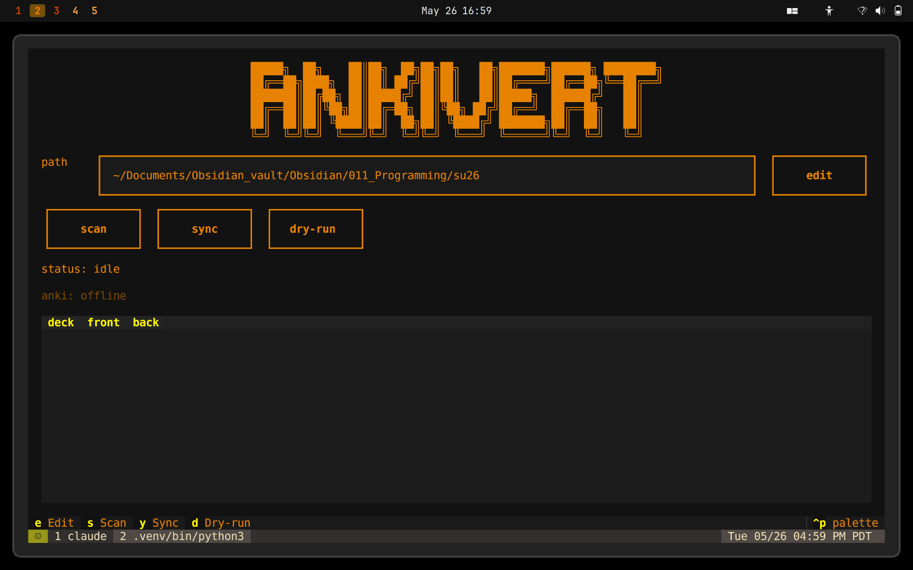

# ankivert

Converts Obsidian markdown notes into Anki flashcards. Scans a vault directory for cards written in a simple `Q:` / `A:` syntax, then syncs them to Anki via the AnkiConnect plugin. A persistent ledger tracks which cards have already been added so re-runs never create duplicates.

---



---

## Requirements

- Python 3.12+
- [Anki](https://apps.ankiweb.net/) with the [AnkiConnect](https://ankiweb.net/shared/info/2055492159) plugin installed and running

## Installation

```bash
git clone https://github.com/your-username/anki_vert.git
cd anki_vert
python3 -m venv .venv
source .venv/bin/activate
pip install -e ".[dev]"
```

## Configuration

Copy the example config and set your vault path:

```bash
cp local_config.example.json local_config.json
```

Then edit `local_config.json`:

```json
{
  "vault_path": "~/Documents/MyVault"
}
```

`local_config.json` is gitignored and never committed. If it is absent, the vault path field in the TUI starts empty.

By default ankivert scans every non-hidden subdirectory of your vault. To restrict scanning to specific subdirectories, add a `"classes"` list:

```json
{
  "vault_path": "~/Documents/MyVault",
  "classes": ["sql", "python", "dsa"]
}
```

## Vault structure and deck names

Anki uses `::` as a deck separator, so a deck named `sql::joins` appears in Anki as a subdeck **joins** nested inside **sql**. ankivert derives deck names from your directory layout:

- Each **immediate subdirectory** of your vault becomes a top-level deck.
- Each **markdown filename** (without the `.md` extension) becomes a subdeck inside it.

```
MyVault/
├── sql/
│   ├── joins.md          →  sql::joins
│   ├── indexes.md        →  sql::indexes
│   └── aggregates.md     →  sql::aggregates
├── python/
│   ├── lists.md          →  python::lists
│   └── decorators.md     →  python::decorators
└── dsa/
    ├── sorting.md        →  dsa::sorting
    └── trees.md          →  dsa::trees
```

This creates the following deck tree in Anki:

```
dsa
  sorting
  trees
python
  decorators
  lists
sql
  aggregates
  indexes
  joins
```

**Tips for clean deck names:**

- Name subject directories after the course or topic (`sql`, `python`, `system_design`).
- Name files after the specific chapter or concept (`joins`, `ch3`, `big_o`). The filename becomes the subdeck label visible in Anki's deck browser.
- Use `_` or `-` instead of spaces if you prefer (`binary_search.md` → `dsa::binary_search`). Anki renders them as-is.
- Files nested deeper than one level are still discovered, but only the filename determines the subdeck — the intermediate directory name is ignored. Keep notes flat within each subject directory if the nesting matters to you.

## Usage

Start Anki, then launch the TUI:

```bash
ankivert
```

| Key / Button | Action |
|---|---|
| `s` | Scan vault and preview new cards |
| `y` | Sync new cards to Anki |
| `d` | Dry-run (preview without writing) |
| `e` | Edit vault path |
| `j` / `k` | Scroll card table |
| `Ctrl+C` | Quit |

## Card syntax

Write cards anywhere inside a markdown file using `Q:` and `A:` markers. The answer ends at the next blank line or end of file. A `Q:` line must be preceded by a blank line (or appear at the start of the file).

```markdown
Q: What does the SQL keyword DISTINCT do?
A: Removes duplicate rows from the result set.

Q: What is the difference between WHERE and HAVING?
A: WHERE filters rows before aggregation.
HAVING filters groups after aggregation.
```

## How deduplication works

Each card is assigned a stable ID derived from its file path, question text, and position in the file. This ID is stored in `.ankivert_ledger.json` after a successful sync. On subsequent runs, cards already in the ledger are skipped, so renaming your vault root or moving the project directory does not cause duplicates.

## Running tests

```bash
pytest -v
```
